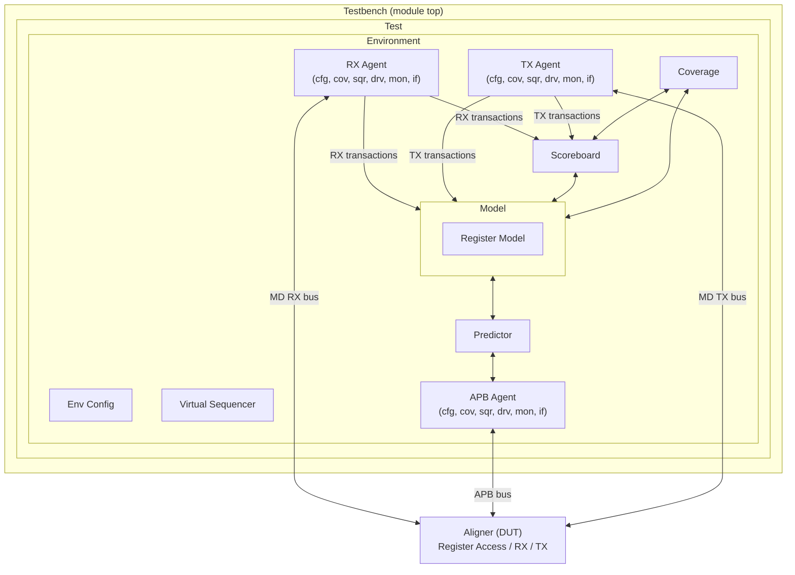

# Design Verification and Testing of the Aligner Module using UVM


A functional verification project for the **Aligner** IP block, built with the **Universal Verification Methodology (UVM)**. The goal is to build a complete, reusable, self-checking, coverage-driven UVM testbench that proves the Aligner (the *DUT*) behaves exactly as described in its datasheet.

> **Repository:** <https://github.com/Vasco-reds/Design-Verification-and-Testing-of-Aligner-using-UVM-methodology>
> **DUT specification:** [`docs/aligner_datasheet_v1.0.pdf`](docs/aligner_datasheet_v1.0.pdf) (Aligner Datasheet v1.0, Cristian Slav / CFS Vision)

---

## Table of Contents

1. [Background](#1-background)
   - [What is the Aligner?](#11-what-is-the-aligner)
   - [What is Design Verification?](#12-what-is-design-verification)
   - [What is UVM?](#13-what-is-uvm)
   - [What is a DUT?](#14-what-is-a-dut)
2. [The DUT in Detail](#2-the-dut-in-detail)
3. [Verification Environment Architecture](#3-verification-environment-architecture)
   - [Big picture](#31-big-picture)
   - [Component-by-component explanation](#32-component-by-component-explanation)
   - [Data flow: what the red arrows mean](#33-data-flow-what-the-red-arrows-mean)
4. [UVM Phases](#4-uvm-phases)
5. [Verification Plan](#5-verification-plan)
6. [Repository Structure](#6-repository-structure)
7. [Getting Started](#7-getting-started)
8. [Datasheet Observations to Clarify](#8-datasheet-observations-to-clarify)
9. [Project Status / Roadmap](#9-project-status--roadmap)
10. [References](#10-references)
11. [Author and License](#11-author-and-license)

---

## 1. Background

### 1.1 What is the Aligner?

The **Aligner** is a small digital hardware block that takes an **unaligned stream of data** and re-emits it as an **aligned stream of data**, according to two configuration fields (`CTRL.SIZE` and `CTRL.OFFSET`).

Memories are most efficient when written with transfers of a specific size at a specific address alignment. Incoming traffic, however, may arrive as arbitrary chunks (for example 1 byte at offset 3, then 2 bytes at offset 0, and so on). The Aligner sits in front of the memory and re-packs the traffic so that only the writes best suited to the memory type are performed.

Example (`ALGN_DATA_WIDTH = 32`, `CTRL.SIZE = 1`, `CTRL.OFFSET = 0`): one RX word carrying 4 valid bytes `32'h44332211` leaves the Aligner as four separate 1-byte TX transfers: `h11`, `h22`, `h33`, `h44`. With `CTRL.SIZE = 4` the opposite happens: several small RX chunks are **merged** into one full 4-byte TX transfer.

Key characteristics:

- Configurable data bus width (`ALGN_DATA_WIDTH`, power of 2, minimum 8, default 32) and FIFO depth (`FIFO_DEPTH`, default 8).
- Register access through a standard **AMBA 3 APB** slave interface.
- Data in and out through two instances of a custom **MD (Memory Data)** protocol: an **RX** interface (Aligner receives) and a **TX** interface (Aligner sends).
- Internal architecture: `RX Controller -> RX FIFO -> Controller -> TX FIFO -> TX Controller`, plus a Register File.
- Illegal RX transfers are rejected (`md_rx_err`), counted (`STATUS.CNT_DROP`) and can raise an interrupt.
- Sticky interrupt requests for FIFO full/empty and drop-counter saturation, combined into a single `irq` output.

### 1.2 What is Design Verification?

**Design Verification (DV)** is the process of proving, *before* silicon is manufactured, that a hardware design (usually written in RTL such as Verilog/SystemVerilog/VHDL) does what its specification says, and does not do anything it should not. Fixing a bug in simulation costs almost nothing; fixing it after tape-out can cost millions, which is why verification typically consumes more than half of a chip project's effort.

Verification is built on three pillars:

| Pillar | Question it answers | How we do it in this project |
|---|---|---|
| **Stimulus** | Did we exercise the design with enough interesting inputs? | Constrained-random UVM sequences on the APB, RX and TX interfaces, plus directed corner cases. |
| **Checking** | Did the design respond correctly? | Reference model + scoreboard, register model predictions, protocol checkers/assertions. |
| **Coverage** | How much of the specification have we actually exercised? | Functional coverage (covergroups) and code coverage. Verification is "done" when coverage goals are met and all checks pass. |

This approach is called **Coverage-Driven Verification (CDV)**. The testbench is **self-checking** (pass/fail is decided automatically, not by looking at waveforms) and **black-box** (it only touches the DUT's ports; it does not depend on internal RTL structure).

### 1.3 What is UVM?

**UVM (Universal Verification Methodology)** is the industry-standard methodology and class library for building verification environments in **SystemVerilog**. It is developed by Accellera and standardised as **IEEE 1800.2**. UVM is supported by all major simulators (Questa, VCS, Xcelium, Riviera-PRO and others).

UVM gives us:

- **A standard architecture**: agents, drivers, monitors, sequencers, scoreboards, environments, tests. Anyone who knows UVM can read the testbench.
- **Reusability**: an agent written for one protocol can be dropped into any project that uses that protocol.
- **Phasing**: a fixed, ordered set of simulation phases (`build`, `connect`, `run`, ...) so that all components initialise, run and report in a coordinated way.
- **The factory**: lets a test replace any component or transaction type with a derived one (type/instance overrides) without editing the environment code.
- **`uvm_config_db`**: a hierarchical configuration database to pass virtual interfaces, config objects and knobs down the component tree.
- **TLM (Transaction-Level Modeling)**: analysis ports/exports and FIFOs to move transactions between components (for example monitor -> scoreboard).
- **Sequences and sequence items**: stimulus is separated from the driver, so the same driver supports many scenarios.
- **RAL (Register Abstraction Layer)**: a model of the DUT's registers with mirroring, prediction and built-in access sequences.
- **Objections**: a mechanism to decide when the run phase may end.
- **Reporting**: severity-based messaging (`UVM_INFO/WARNING/ERROR/FATAL`) with verbosity control and a final report.

### 1.4 What is a DUT?

**DUT = Device Under Test** (also called *DUV*, Design Under Verification). It is the hardware design being verified. In this project the **DUT is the Aligner RTL**. The testbench instantiates it, wraps it with interfaces, drives its inputs, observes its outputs and compares the observed behaviour with the expected behaviour derived from the datasheet.

---

## 2. The DUT in Detail

Everything in this section is taken from the Aligner Datasheet v1.0 and is the "source of truth" for the testbench.

### 2.1 Parameters

| Name | Default | Description |
|---|---|---|
| `ALGN_DATA_WIDTH` | 32 | Width in bits of the MD data buses (`md_rx_data`, `md_tx_data`). Must be a power of 2, minimum 8. |
| `FIFO_DEPTH` | 8 | Depth of both the RX FIFO and the TX FIFO. |

### 2.2 Interfaces and signals

| Group | Signals | Direction (from DUT) | Notes |
|---|---|---|---|
| Clock / reset | `clk`, `reset_n` | IN | `reset_n` is active low. |
| APB (AMBA 3) | `psel`, `penable`, `pwrite`, `paddr[15:0]`, `pwdata[31:0]` | IN | `paddr[1:0]` ignored (always word aligned). |
| | `pready`, `prdata[31:0]`, `pslverr` | OUT | Max. 5 wait states are legal. |
| MD RX | `md_rx_valid`, `md_rx_data`, `md_rx_offset`, `md_rx_size` | IN | Once `valid` is high it must stay high until `ready`. Data/offset/size must remain constant until `ready`. Size 0 is illegal. |
| | `md_rx_ready`, `md_rx_err` | OUT | `err` may be high only when `valid` and `ready` are both high. |
| MD TX | `md_tx_valid`, `md_tx_data`, `md_tx_offset`, `md_tx_size` | OUT | Same stability rules as RX. |
| | `md_tx_ready`, `md_tx_err` | IN | `err` may be high only when `valid` and `ready` are both high. |
| Interrupt | `irq` | OUT | OR of all enabled interrupt requests. |

Widths: `md_*_offset` = `max(1, log2(ALGN_DATA_WIDTH/8))` bits, `md_*_size` = `log2(ALGN_DATA_WIDTH/8)+1` bits.

**Legal (offset, size) combination**, applicable to RX transfers, TX transfers and to `CTRL` programming:

```
((ALGN_DATA_WIDTH / 8) + offset) % size == 0
```

For the default 32-bit bus this gives the following combinations (see also [Section 8](#8-datasheet-observations-to-clarify)):

| SIZE | Legal OFFSET values (by the equation) |
|---|---|
| 1 | 0, 1, 2, 3 |
| 2 | 0, 2 |
| 3 | 2 (equation admits it, but data would not fit in the bus, see Section 8) |
| 4 | 0 |

### 2.3 Register map (APB)

| Mnemonic | Offset | Description |
|---|---|---|
| `CTRL` | `0x0000` | Control register |
| `STATUS` | `0x000C` | Status register |
| `IRQEN` | `0x00F0` | Interrupt requests enable register |
| `IRQ` | `0x00F4` | Interrupt requests register |

Access types: **RW** (read/write), **RO** (read-only), **WO** (write-only, reads return 0), **W1C** (write 1 to clear, write 0 has no effect).

**`CTRL` (0x0000)**

| Field | Bits | Access | Reset | Description |
|---|---|---|---|---|
| `SIZE` | [2:0] | RW | 1 | Size in bytes of the aligned data. Writing 0 or an illegal (SIZE, OFFSET) combination returns an APB error. |
| `OFFSET` | [9:8] | RW | 0 | Offset in bytes of the aligned data. Illegal combination returns an APB error. |
| `CLR` | [16] | WO | 0 | Writing 1 clears `STATUS.CNT_DROP`. Reads return 0. |
| reserved | others | RO | 0 | |

**`STATUS` (0x000C)**: fully read-only, a write must return an APB error.

| Field | Bits | Access | Reset | Description |
|---|---|---|---|---|
| `CNT_DROP` | [7:0] | RO | 0 | Number of dropped (illegal) RX accesses. Saturates at max, does not wrap. |
| `RX_LVL` | [11:8] | RO | 0 | Fill level of the RX FIFO. |
| `TX_LVL` | [19:16] | RO | 0 | Fill level of the TX FIFO. |
| reserved | others | RO | 0 | |

**`IRQEN` (0x00F0)**: one RW enable bit per interrupt, reset 0.

| Bit | Field |
|---|---|
| 0 | `RX_FIFO_EMPTY` |
| 1 | `RX_FIFO_FULL` |
| 2 | `TX_FIFO_EMPTY` |
| 3 | `TX_FIFO_FULL` |
| 4 | `MAX_DROP` |

**`IRQ` (0x00F4)**: same five bit positions as `IRQEN`, all **W1C** and **sticky**. A bit is set whenever the event happens (regardless of `IRQEN`) and stays set until software writes 1 to it. Clearing a bit while the condition still holds does *not* re-set it immediately; it is set again only on the next occurrence of the event (for example `RX_LVL` going 1 -> 0).

APB errors (`pslverr = 1`) must be returned for: access to an unmapped address, write to `STATUS`, and write to `CTRL` with an illegal (SIZE, OFFSET) combination or `SIZE = 0`.

### 2.4 Functional behaviour summary

| Block | Responsibility |
|---|---|
| **RX Controller** | Drives `md_rx_ready` (backpressure: low when RX FIFO is full). Checks each RX transfer against the legality equation; on violation asserts `md_rx_err`, does not forward the data, and increments `STATUS.CNT_DROP` (saturating). Raises `IRQ.MAX_DROP` when the counter reaches its maximum. |
| **RX FIFO** | Buffers incoming legal transfers. Level is visible in `STATUS.RX_LVL`. Raises `RX_FIFO_EMPTY` / `RX_FIFO_FULL` events. |
| **Controller** | Takes data out of the RX FIFO, aligns it per `CTRL.SIZE`/`CTRL.OFFSET` (splitting and/or merging) and pushes it to the TX FIFO. Stalls while the TX FIFO is full. |
| **TX FIFO** | Buffers aligned data. Level is visible in `STATUS.TX_LVL`. Raises `TX_FIFO_EMPTY` / `TX_FIFO_FULL` events. |
| **TX Controller** | Pops the TX FIFO and drives the MD TX interface, honouring `md_tx_ready`. |
| **Register File** | APB slave holding `CTRL`, `STATUS`, `IRQEN`, `IRQ`; generates `pslverr`; produces `irq`. |

---

## 3. Verification Environment Architecture

### 3.1 Big picture

The environment below is the structure this project implements. All development work happens inside it.


> Save the environment picture as `docs/images/uvm_environment.png` so the image above renders on GitHub.

The same architecture as a GitHub-rendered diagram (red arrows in the original picture correspond to the analysis-port / TLM connections):



### 3.2 Component-by-component explanation

The components are described from the outside in: first the containers (testbench, test, environment), then the stimulus path (virtual sequencer, agents), then the checking path (monitors, model, register model, predictor, scoreboard, coverage), and finally the DUT.

---

#### 3.2.1 Testbench (top level)

**What it is:** the outermost container. Strictly speaking it is a plain SystemVerilog `module` (commonly `tb_top`), *not* a UVM class. It is the only place where the static, synthesizable-style hardware world meets the dynamic, class-based UVM world.

**What it does:**

- Generates the **clock** and the active-low **reset** (`clk`, `reset_n`).
- Instantiates the three **SystemVerilog interfaces** (APB, MD RX, MD TX).
- Instantiates the **DUT** (the Aligner) and wires its ports to those interfaces, with the parameters `ALGN_DATA_WIDTH` and `FIFO_DEPTH` set.
- Publishes each **virtual interface** handle into `uvm_config_db` so that drivers and monitors deeper in the hierarchy can find them.
- Calls `run_test()`, which builds the test named on the command line (`+UVM_TESTNAME=...`) and starts the UVM phases.

```systemverilog
// Illustrative example: names are placeholders
initial begin
  uvm_config_db#(virtual apb_if)::set(null, "uvm_test_top.env.apb_agent*", "vif", apb_vif);
  uvm_config_db#(virtual md_if )::set(null, "uvm_test_top.env.rx_agent*",  "vif", rx_vif);
  uvm_config_db#(virtual md_if )::set(null, "uvm_test_top.env.tx_agent*",  "vif", tx_vif);
  run_test();
end
```

---

#### 3.2.2 Test(s)

**What it is:** a class extending `uvm_test`. There is one *base test* and many *derived tests*; each derived test is one verification scenario (or a family of scenarios).

**What it does:**

- **Creates the environment** (and the configuration objects) in `build_phase`.
- **Configures the environment** through the config DB and/or by editing config objects: which agents are active, which checks/coverage are enabled, FIFO depth, data width, and so on.
- **Selects and starts the stimulus**: in `run_phase` it raises an objection, starts one or more (virtual) sequences, waits for completion, then drops the objection so the simulation can end.
- **Uses the factory** to override behaviour without touching the environment (for example replacing the default RX item with one that constrains toward illegal sizes, or forcing the TX agent to insert long `ready` delays).

Only the *test* changes between scenarios. The *environment* stays the same, which is the central idea of UVM reuse.

---

#### 3.2.3 Environment

**What it is:** a class extending `uvm_env`. It is the container that holds every verification component related to the DUT and defines how they are connected.

**What it does:**

- `build_phase`: creates the three agents, the virtual sequencer, the model (with register model), predictor, scoreboard and coverage components, and pushes the right sub-configuration to each.
- `connect_phase`: wires all TLM connections (monitor analysis ports -> model / scoreboard / coverage / predictor), connects the register model to the APB sequencer through an adapter, and populates the virtual sequencer with handles to the agent sequencers.
- Contains no stimulus and no pin-level code; it is purely structural.

```systemverilog
// Illustrative example of what the env connect_phase looks like
function void connect_phase(uvm_phase phase);
  super.connect_phase(phase);

  // Monitors -> model and scoreboard
  rx_agent.monitor.output_port.connect(model.rx_export);
  tx_agent.monitor.output_port.connect(model.tx_export);
  rx_agent.monitor.output_port.connect(scoreboard.rx_export);
  tx_agent.monitor.output_port.connect(scoreboard.tx_export);

  // Register model: front-door access via APB agent + prediction from APB monitor
  model.reg_block.default_map.set_sequencer(apb_agent.sequencer, reg_adapter);
  model.reg_block.default_map.set_auto_predict(0);
  predictor.map     = model.reg_block.default_map;
  predictor.adapter = reg_adapter;
  apb_agent.monitor.output_port.connect(predictor.bus_in);

  // Virtual sequencer gets handles to the real sequencers
  virt_sequencer.rx_sequencer  = rx_agent.sequencer;
  virt_sequencer.tx_sequencer  = tx_agent.sequencer;
  virt_sequencer.apb_sequencer = apb_agent.sequencer;
endfunction
```

---

#### 3.2.4 Config (Environment configuration, top-left of the environment)

**What it is:** a `uvm_object`-based configuration class for the whole environment (agents also have their own smaller config objects, see below).

**What it does:** collects every "knob" that controls how the environment is built and behaves, so that a test can change the environment without editing it:

- Which agents exist and whether each is **active** (drives signals) or **passive** (only observes).
- Whether the scoreboard, model checks, protocol checks and coverage collection are **enabled**.
- DUT-related constants the checkers need to know: `ALGN_DATA_WIDTH`, `FIFO_DEPTH`.
- Handles to the virtual interfaces (or the agent configs that carry them).

The test creates it, sets its fields, and stores it with `uvm_config_db`; the environment retrieves it in `build_phase`.

---

#### 3.2.5 Virtual Sequencer

**What it is:** a sequencer that is *not connected to any driver*. It exists purely to run **virtual sequences**, which are sequences that coordinate several real sequencers.

**Why it is needed:** a meaningful Aligner scenario involves all three interfaces at once. For example:

1. Program `CTRL.SIZE`/`CTRL.OFFSET` through **APB**.
2. Send a burst of MD transfers on **RX**.
3. Simultaneously hold `md_tx_ready` low for a while on **TX** to fill the TX FIFO and back-pressure the RX side.
4. Read `STATUS` and `IRQ` through **APB** and clear interrupts.

No single agent sequencer can express that. A virtual sequence, running on the virtual sequencer, holds handles to `rx_sequencer`, `tx_sequencer` and `apb_sequencer` and starts sub-sequences on each, in parallel or in order.

---

#### 3.2.6 Agents (RX Agent, APB Agent, TX Agent)

**What an agent is:** a `uvm_agent` is a self-contained, reusable verification component for **one interface/protocol**. It bundles everything needed to talk to that interface: configuration, sequencer, driver, monitor, coverage collector and a virtual interface handle. An agent has two modes, controlled by its `is_active` setting:

- **Active** (`UVM_ACTIVE`): sequencer + driver + monitor (+ coverage) are built; the agent generates stimulus.
- **Passive** (`UVM_PASSIVE`): only monitor (+ coverage) are built; the agent just observes. This is useful when the interface is driven by something else, for example in a sub-system integration.

In this project there are three agents:

| Agent | Protocol | Role toward the DUT | Talks to DUT pins |
|---|---|---|---|
| **RX Agent** | Custom MD | *Master/initiator*: sends unaligned data into the Aligner | `md_rx_valid/data/offset/size` (drives), `md_rx_ready/err` (samples) |
| **TX Agent** | Custom MD | *Slave/responder*: receives aligned data from the Aligner, controls backpressure | `md_tx_valid/data/offset/size` (samples), `md_tx_ready/err` (drives) |
| **APB Agent** | AMBA 3 APB | *Master*: reads/writes the Aligner registers | `psel/penable/pwrite/paddr/pwdata` (drives), `pready/prdata/pslverr` (samples) |

Because RX and TX use the **same MD protocol**, the two MD agents can share the same interface definition, sequence item and much of the driver/monitor code, differing only in direction/role (master vs. slave).

Every agent contains the following sub-components (all six appear inside each agent box in the diagram):

##### Config (agent)

A `uvm_object` holding agent-specific settings: `is_active`, the virtual interface handle, whether coverage/checks are enabled, and protocol-specific knobs (for example min/max delay between transfers, `ready` delay range and error injection probability for the TX agent, number of wait states the APB agent tolerates).

##### Sequence item (transaction)

The transaction-level description of one protocol transfer, a `uvm_sequence_item` with randomizable fields and constraints:

- **MD item:** `data`, `offset`, `size`, plus response fields (`err`) and timing knobs (delay before `valid`, number of cycles before `ready`). Constraints can steer toward legal combinations, illegal combinations, or a mix.
- **APB item:** `addr`, `data`, `read/write`, and response fields (`pslverr`, `prdata`, number of wait states).

##### Sequencer

A `uvm_sequencer` that arbitrates between sequences and hands sequence items to the driver on request. It decouples *what* to send (sequences) from *how* to send it (driver). Each agent's sequencer is registered with the virtual sequencer.

##### Driver

A `uvm_driver` that pulls items from the sequencer (`get_next_item` / `item_done`) and **converts them into pin-level activity** on the virtual interface, cycle by cycle, obeying the protocol:

- **RX driver (MD master):** asserts `md_rx_valid` with `data/offset/size`, **holds them stable** until `md_rx_ready` goes high, then samples `md_rx_err` and returns it in the response. Inserts idle cycles between transfers according to the item's delay knobs.
- **TX driver (MD slave):** drives `md_tx_ready` according to a configurable pattern (always ready, random delays, long stalls to fill the TX FIFO) and can drive `md_tx_err` when `valid && ready`.
- **APB driver (APB master):** performs the SETUP phase (`psel=1`, `penable=0`) followed by the ACCESS phase (`penable=1`), waits for `pready` (up to 5 wait states are legal), and captures `prdata` and `pslverr`.

The driver is the only component that *drives* DUT inputs.

##### Monitor

A `uvm_monitor` that **passively observes** the interface, reconstructs complete protocol transactions and broadcasts them through a `uvm_analysis_port`. It never drives any signal, so it is identical in active and passive mode. A monitor records a transfer exactly when the protocol says it completed:

- MD monitors: a transfer is sampled on a clock edge where `valid && ready` (for RX also capturing `md_rx_err`; for TX also `md_tx_err`).
- APB monitor: a transfer is sampled at the end of the ACCESS phase (`psel && penable && pready`), capturing address, direction, data and `pslverr`.

Monitors also perform **protocol checks** (or work together with assertions in the interface), for example:

- `valid` must remain high until `ready`.
- `data/offset/size` must stay constant while `valid` is high and `ready` is low.
- `size` must never be 0.
- `err` may only be high when `valid && ready`.
- APB: no more than 5 wait states.

##### Coverage (agent)

A `uvm_subscriber`-style component (or covergroups embedded in the monitor) that subscribes to the monitor's transactions and collects **protocol-level functional coverage**: for example, all `offset`/`size` values seen on the interface, `ready` delay buckets, back-to-back transfers, error responses on APB, addresses accessed, read vs. write. It answers the question "did we exercise the interface fully?", independent of what the DUT did with the data.

##### Interface (SystemVerilog `interface`)

The bundle of physical signals for that protocol. It:

- Groups the signals so they can be passed around as one object.
- Provides **clocking blocks** (to avoid driver/DUT race conditions) and **modports**.
- Is accessed from the UVM classes as a **`virtual interface`** obtained from `uvm_config_db`.
- Is the natural home for **SystemVerilog Assertions (SVA)** for the protocol.

In the picture, the double-headed red arrows at the bottom of each agent are the pin-level connection between the agent's interface and the corresponding side of the Aligner: RX agent <-> Aligner **RX**, TX agent <-> Aligner **TX**, APB agent <-> Aligner **Register Access**.

---

#### 3.2.7 Predictor

**What it is:** a `uvm_reg_predictor#(apb_item)`, the bridge between the **APB monitor** and the **Register Model**.

**What it does:** every time the APB monitor observes a completed register transfer, the predictor receives it, uses the **adapter** (`bus2reg`) to translate the bus transaction into a register operation (which register, read or write, what value) and **updates the register model's mirror** accordingly. This is called *explicit prediction* (auto-prediction on the register map is turned off), and it has one great advantage: it also captures accesses that did **not** originate from the register model itself, such as directed APB traffic from a sequence.

The double arrow in the diagram reflects both directions of the register path:

- **Down (stimulus):** Register Model -> adapter (`reg2bus`) -> APB sequencer/driver -> DUT (front-door access).
- **Up (observation):** DUT -> APB monitor -> Predictor -> Register Model mirror update.

---

#### 3.2.8 Register Model (RAL)

**What it is:** a `uvm_reg_block` that mirrors the Aligner's register file in the testbench, built with the UVM Register Abstraction Layer. It lives inside the **Model** in the diagram.

**What it contains:** one `uvm_reg` per register (`CTRL`, `STATUS`, `IRQEN`, `IRQ`), each made of `uvm_reg_field`s configured with the correct **width, offset, access policy and reset value** taken from the datasheet:

| Register | Fields and policies to model |
|---|---|
| `CTRL` | `SIZE` (RW, reset 1), `OFFSET` (RW, reset 0), `CLR` (WO), reserved (RO) |
| `STATUS` | `CNT_DROP`, `RX_LVL`, `TX_LVL` (all RO, **volatile** because hardware changes them) |
| `IRQEN` | five RW enable bits |
| `IRQ` | five W1C sticky bits (**volatile**, set by hardware) |

It also defines an **address map** with the offsets `0x0000`, `0x000C`, `0x00F0`, `0x00F4`.

**What it gives us:**

- Each register holds a **desired** value and a **mirrored** value (the testbench's best knowledge of the DUT's value).
- High-level API: `write()`, `read()`, `update()`, `mirror()`, `predict()`, `reset()`, `get()`, `set()`, so sequences work with names and fields instead of raw addresses.
- The Model uses the mirrored `CTRL.SIZE` / `CTRL.OFFSET` to know how the DUT is currently configured.
- Built-in sequences (reset value check, bit-bash, register access) as a quick first sanity test. Fields with special behaviour (W1C, WO, volatile) need care or exclusion from generic sequences.

---

#### 3.2.9 Model (reference model)

**What it is:** the environment's **golden reference**, a behavioural (transaction-level, not RTL) implementation of the Aligner's specified functionality. It contains the Register Model and consumes transactions from the monitors.

**What it does:** given the traffic actually seen at the DUT's boundaries and the current configuration, it **predicts what the DUT should do**:

- **Data path prediction:** for every legal RX transfer, it computes the expected sequence of TX transfers (`data`, `offset`, `size`) according to `CTRL.SIZE`/`CTRL.OFFSET`, including the split and merge behaviour shown in datasheet Figures 6-9.
- **Error prediction:** decides whether each RX transfer is legal by evaluating `((ALGN_DATA_WIDTH/8) + offset) % size == 0`, and therefore whether `md_rx_err` should have been asserted and `CNT_DROP` incremented (saturating, cleared by `CTRL.CLR`).
- **FIFO/status prediction:** tracks expected `RX_LVL` and `TX_LVL`. This is why the model needs to see **both** the RX and the TX monitors: the RX side fills the pipeline and the TX side (through `md_tx_ready`) drains it.
- **Interrupt prediction:** derives the expected sticky `IRQ` bits (FIFO empty/full events, max-drop) and the expected `irq` output from `IRQ & IRQEN`.
- **Register prediction:** combines with the Register Model for register read values and expected `pslverr`.

The Model does **not** compare anything itself; it only produces expectations. The comparison is the scoreboard's job.

---

#### 3.2.10 Scoreboard

**What it is:** a `uvm_scoreboard` that performs the actual **checking** by comparing *what the DUT did* with *what the Model expected*.

**What it checks:**

| Check | Actual (from) | Expected (from) |
|---|---|---|
| Aligned output data | TX monitor (`data`, `offset`, `size`) | Model's predicted TX transfer stream |
| RX error response | RX monitor (`md_rx_err`) | Model's legality evaluation |
| Register reads | APB monitor (`prdata`) | Register model mirror / model status prediction |
| APB error response | APB monitor (`pslverr`) | Model (unmapped address, write to `STATUS`, illegal `CTRL` write) |
| `irq` and `IRQ` register | APB reads / `irq` pin | Model interrupt prediction |

Because the Aligner has FIFOs and no reordering, the data comparison is **in-order**: expected transactions are pushed into a queue (or a `uvm_tlm_analysis_fifo`) and each observed TX transaction is compared against the head of that queue. Mismatches call `uvm_error`; end-of-test also checks that the expected queue is empty (no lost data) and that no unexpected extra data appeared. The two-way arrows between Scoreboard and Model represent this exchange of expected/actual information.

---

#### 3.2.11 Coverage (environment level, between Scoreboard and Model)

**What it is:** the **system-level functional coverage** collector. Unlike agent coverage (which only sees one protocol), this one sees the *relationship* between configuration, traffic and DUT state, using information from the Model and the Scoreboard.

**Examples of what it measures:**

- Cross of `CTRL.SIZE` x `CTRL.OFFSET` x RX `size` x RX `offset` (every legal and illegal combination met).
- Every `RX_LVL` and `TX_LVL` value, including transitions `0->1`, `MAX-1->MAX`, `MAX->MAX-1`, `1->0`.
- `CNT_DROP` values: 0, intermediate, saturated; `CLR` while saturated.
- Every IRQ bit set, cleared, set while enabled/disabled; clear-while-condition-still-true behaviour.
- APB error scenarios: unmapped address, write to `STATUS`, illegal `CTRL` write.
- Traffic patterns: back-to-back RX, RX stalled by full FIFO, TX starved, TX stalled.

Coverage closure (functional plus code coverage) is what tells us when verification is complete.

---

#### 3.2.12 Aligner (the DUT, bottom of the picture)

The RTL under verification. The three ports shown in the diagram correspond to the interfaces above:

- **Register Access** (top of the box): APB slave, connected to the APB agent.
- **RX** (left): MD RX slave, connected to the RX agent.
- **TX** (right): MD TX master, connected to the TX agent.

It is deliberately the *only* non-UVM thing in the picture. Everything else is testbench.

---

### 3.3 Data flow: what the red arrows mean

| Arrow | Meaning |
|---|---|
| RX Agent (monitor) -> Scoreboard | Every RX transfer accepted by the DUT is reported, so the scoreboard can relate actual DUT behaviour to the input traffic. |
| RX Agent (monitor) -> Model | The Model consumes the RX transfers to compute the expected aligned output, drop count and RX FIFO level. |
| TX Agent (monitor) -> Scoreboard | Every aligned transfer produced by the DUT is reported for comparison with the prediction. |
| TX Agent (monitor) -> Model | TX drain events let the Model keep the TX/RX FIFO levels and interrupt events accurate. |
| Scoreboard <-> Model | The Model supplies expected results; the scoreboard supplies observed results for checking. |
| Coverage <-> Model / Scoreboard | Coverage samples the predicted and observed state to measure how much of the spec has been exercised. |
| Model / Register Model <-> Predictor <-> APB Agent | Register access path: front-door stimulus down, observed APB transfers up to keep the mirror in sync. |
| Agent Interface <-> Aligner | Pin-level connection through the SystemVerilog interfaces. |

---

## 4. UVM Phases

Every UVM component goes through the same ordered set of phases. The slide in the course material lists them in the order below; this table adds what each one is used for **in this project**.

| # | Phase | Kind | Traversal | Typical use in this testbench |
|---|---|---|---|---|
| 1 | `build_phase()` | function | top-down | Create components (`type_id::create`), get config objects and virtual interfaces from `uvm_config_db`, create the register model. Parents are built before children so a parent can configure its children. |
| 2 | `connect_phase()` | function | bottom-up | Connect TLM ports (monitors -> model/scoreboard/coverage/predictor), connect the register map to the APB sequencer + adapter, hand sequencer handles to the virtual sequencer. |
| 3 | `end_of_elaboration_phase()` | function | bottom-up | Structure is complete. Print the topology (`uvm_top.print_topology()`), verify that configuration is consistent, set report verbosity. |
| 4 | `start_of_simulation_phase()` | function | bottom-up | Last step before time advances. Print banners/configuration summary, final sanity checks on handles. |
| 5 | `run_phase()` | **task** | parallel (consumes time) | The only phase that consumes simulation time. Drivers drive, monitors sample, the model/scoreboard react, the test raises/drops objections and starts sequences. It runs in parallel with the runtime sub-phases (`reset`, `configure`, `main`, `shutdown`) if those are used. |
| 6 | `extract_phase()` | function | bottom-up | After the run: collect final data (for example remaining queue contents, final counters, final register mirror values). |
| 7 | `check_phase()` | function | bottom-up | Perform end-of-test checks: scoreboard queues empty, no outstanding transactions, no unexpected pending interrupts. |
| 8 | `report_phase()` | function | bottom-up | Print summaries: number of transactions, mismatches, coverage results, final PASS/FAIL. |
| 9 | `final_phase()` | function | top-down | Last cleanup (close files, release resources). |

Rules of thumb: phases 1-4 and 6-9 are **functions** (zero time); only `run_phase` is a **task**. All components complete a phase before any component starts the next one, which guarantees that, for example, every connection exists before any transaction flows.

---

## 5. Verification Plan

### 5.1 Features to verify

- **Alignment function:** correct splitting/merging for every legal (`CTRL.SIZE`, `CTRL.OFFSET`) pair against all legal RX (`offset`, `size`) pairs and data patterns.
- **RX legality check:** `md_rx_err`, no data forwarded on error, `CNT_DROP` increments, saturation without wrap, `CTRL.CLR`.
- **Flow control / backpressure:** `md_rx_ready` behaviour with RX FIFO full, Controller stalls with TX FIFO full, TX starvation.
- **FIFO levels:** `STATUS.RX_LVL` / `STATUS.TX_LVL` correctness at all times.
- **Register block:** reset values, access types (RW/RO/WO/W1C), reserved fields, `pslverr` cases, `paddr[1:0]` ignored.
- **Interrupts:** each event sets its `IRQ` bit regardless of `IRQEN`, stickiness, W1C clearing, no immediate re-set when cleared while condition persists, `irq` output composition.
- **Protocol compliance (DUT outputs):** MD TX stability rules, size never 0, legal offset/size on TX; APB wait-state limit.
- **Reset behaviour:** asynchronous/synchronous assertion at any point, including mid-traffic.
- **Parameterisation:** re-run key tests with other `ALGN_DATA_WIDTH` (8, 16, 32, 64) and `FIFO_DEPTH` values.

### 5.2 Planned tests

| Test | Purpose |
|---|---|
| `test_reg_reset` / `test_reg_access` | Reset values; RW/RO/WO/W1C behaviour; unmapped and illegal accesses. |
| `test_ctrl_legal_illegal` | Program every (SIZE, OFFSET) pair, check accept/`pslverr`, check config unchanged on error. |
| `test_align_directed` | Reproduce the datasheet figures (SIZE/OFFSET = 1/0, 1/2, 2/2, 4/0). |
| `test_align_random` | Constrained-random legal RX traffic across all configurations. |
| `test_rx_illegal` | Illegal RX combinations, `md_rx_err`, `CNT_DROP`, saturation, `MAX_DROP`, `CLR`. |
| `test_fifo_full_empty` | Fill/drain both FIFOs via TX backpressure; check levels and IRQs. |
| `test_irq` | Enable/disable masks, sticky behaviour, W1C, clear-while-active. |
| `test_reset_mid_traffic` | Reset in the middle of transfers; verify clean recovery. |
| `test_stress` | Long random mix of APB, RX and TX activity with random delays. |

### 5.3 Checks summary

Scoreboard data comparison, RX-error prediction, register read/`pslverr` prediction, IRQ/`irq` prediction, protocol monitors/assertions, end-of-test cleanliness.

### 5.4 Coverage goals

100% functional coverage on the plan above and high code coverage (line, branch, condition, toggle, FSM) on the Aligner RTL, with any exclusions justified.

---

## 6. Repository Structure

> Proposed layout. Adjust to match what is actually committed.

```
.
├── README.md
├── docs/
│   ├── aligner_datasheet_v1.0.pdf
│   └── images/
│       └── uvm_environment.png
├── rtl/                      # Aligner DUT sources
├── tb/
│   ├── tb_top.sv             # Testbench top module
│   ├── env/                  # Environment, config, virtual sequencer
│   ├── agents/
│   │   ├── md/               # MD agent (used for RX and TX)
│   │   └── apb/              # APB agent
│   ├── model/                # Reference model + register model + predictor
│   ├── scoreboard/
│   ├── coverage/
│   ├── sequences/            # Base, virtual and register sequences
│   └── tests/
├── sim/                      # Compile/run scripts, filelists
└── results/                  # Logs, coverage reports (git-ignored)
```

---

## 7. Getting Started

### Prerequisites

- A SystemVerilog simulator with UVM support (Questa/ModelSim, Synopsys VCS, Cadence Xcelium, or Aldec Riviera-PRO).
- UVM 1.2 library (bundled with most simulators).

### Clone

```bash
git clone https://github.com/Vasco-reds/Design-Verification-and-Testing-of-Aligner-using-UVM-methodology.git
cd Design-Verification-and-Testing-of-Aligner-using-UVM-methodology
```

### Run a test

Replace the placeholders with the scripts/filelists used in this repository. Example with Questa:

```bash
vlog -sv +incdir+<uvm_src> -f sim/filelist.f
vsim -c tb_top +UVM_TESTNAME=<test_name> +UVM_VERBOSITY=UVM_MEDIUM -do "run -all; quit"
```

Useful plusargs: `+UVM_TESTNAME=<test>`, `+UVM_VERBOSITY=<UVM_LOW|UVM_MEDIUM|UVM_HIGH>`, `+UVM_TIMEOUT=<time>`.

---

## 8. Datasheet Observations to Clarify

While reading the datasheet (v1.0) for the verification plan, the following points are ambiguous or inconsistent. Each should be settled (with the spec author or by agreeing on an interpretation) before writing the related checker.

1. **Legality equation and bus overflow.** `((ALGN_DATA_WIDTH/8) + offset) % size == 0` also accepts (`size = 3`, `offset = 2`) on a 32-bit bus (`6 % 3 == 0`), although `offset + size = 5` bytes does not fit in a 4-byte bus. Confirm whether this combination should be legal.
2. **`CTRL.SIZE` range.** The field is 3 bits wide (0-7) while a 32-bit bus can carry at most 4 bytes. The expected behaviour for values 5-7 (illegal combination -> `pslverr`?) should be confirmed.
3. **`md_tx_err` behaviour.** It is an input to the DUT, but the datasheet does not say how the DUT reacts to it. The TX agent should not inject errors until this is defined.
4. **`irq` as pulse vs. level.** Section 4.4 says interrupts are generated as a one-cycle pulse, while Figure 11 ANDs the *sticky* `IRQ` bits with `IRQEN`, which would make `irq` level-sensitive while a bit is set. Define which one the checker should model.
5. **Behaviour on reset in flight.** The datasheet does not state what happens to data inside the FIFOs when `reset_n` is asserted mid-traffic (assumed: everything is flushed and registers return to reset values).
6. **Register state after an errored `CTRL` write.** It is implied but not stated that `CTRL` keeps its previous value when a write returns `pslverr`.
7. **`pslverr` width** is blank in the signal table (presumably 1 bit).
8. **Minor typos:** Figure 10 text says `CTRL.SIZE = 11` while the caption says `CTRL.SIZE = 1`; several register sections say "fields of the Control register" for other registers.

---

## 9. Project Status / Roadmap

- [x] Study the Aligner datasheet and define the verification plan
- [ ] Testbench top, interfaces and DUT hookup
- [ ] MD agent (RX master role / TX slave role)
- [ ] APB agent
- [ ] Register model, adapter and predictor
- [ ] Reference model
- [ ] Scoreboard
- [ ] Coverage (agent-level and environment-level)
- [ ] Virtual sequencer and virtual sequences
- [ ] Base test and directed tests
- [ ] Constrained-random and stress tests
- [ ] Coverage closure and final report

*(Tick the boxes as the work progresses.)*

---

## 10. References

- Aligner Datasheet v1.0, Cristian Slav, CFS Vision (included in `docs/`).
- **UVM 1.2 Class Reference**, Accellera Systems Initiative.
- **IEEE 1800.2-2020**, *Standard for Universal Verification Methodology Language Reference Manual*.
- **IEEE 1800-2017**, *SystemVerilog Language Reference Manual*.
- **AMBA 3 APB Protocol Specification**, Arm.
- Course material: *Environment Coding Kick Off, Run UVM Phases* lecture (source of the phase list and environment diagram).

---

## 11. Author and License

**Author:** [Vasco-reds](https://github.com/Vasco-reds)

The Aligner datasheet and RTL are the work of their original author (Cristian Slav / CFS Vision) and are included here for educational verification purposes. Add a `LICENSE` file for your own testbench code (for example MIT or Apache-2.0) and update this section accordingly.
